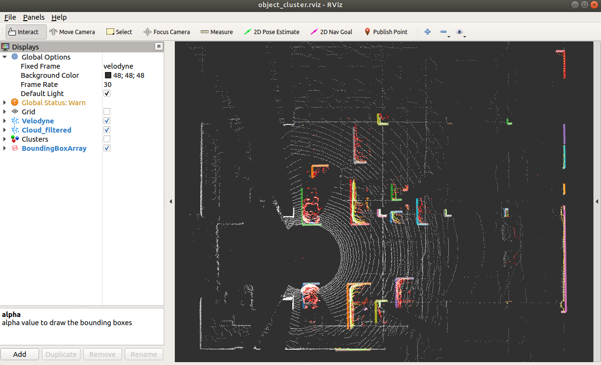

# Object Cluster




## Environment
* Ubuntu 18.04
* ROS Melodic

## Data
* RosBag for offline testing

## IO
- input  
/points_raw (sensor_msgs::PointCloud2)   
- output  
/object_cluster/clusters (object_cluster::ClusterArray)    
/object_cluster/detected_bounding_boxs (jsk_recognition_msgs::BoundingBoxArray)   

## How to use
* Move the project into the ROS workspace (e.g. ~/ros_ws/src/)
* Build the project in the ROS workspace
  ```bash
  cd ros_ws/
  catkin_make
  ```
* Setup the parameters in [object_cluster.launch](./launch/object_cluster.launch)
  ```xml
  <!-- Common Parameters -->
  <arg name="sensor_model" default="64" doc="Divide the point cloud into nested circular regions centred at the sensor. 16/32/64"/>
  <arg name="print_fps" default="true" doc="Print the FPS on the terminal."/>

  <!-- Crop Parameters -->
  <arg name="x_axis_min" default="0.0" doc="Backward"/>
  <arg name="x_axis_max" default="80.0" doc="Forward"/>
  <arg name="y_axis_min" default="-20.0" doc="Right"/>
  <arg name="y_axis_max" default="20.0" doc="Left"/>
  <arg name="z_axis_min" default="-0.70" doc="Downward (e.g. the height of the LIDAR.)"/>
  <arg name="z_axis_max" default="0.5" doc="Upward"/>

  <!-- Cluster Parameters -->
  <arg name="cluster_size_min" default="10" doc="The minimum number of the points to be clustered."/>
  <arg name="cluster_size_max" default="10000" doc="The maximum number of the points to be clustered."/>
  ```
  > Note: The default parameters work well with OUSTER-64.

* Run the Object Cluster
  * Source the setup.bash
    ```bash
    cd ros_ws
    source devel/setup.bash
    ```
  
  * Launch the Object Cluster node
    ```bash
    roslaunch object_cluster object_cluster.launch
    ```

* Play the rosbag for offline testing
  ```bash
  rosbag play offline_testing.bag
  ```

* Subscribe the clustered objects messages from the topic `/object_cluster/detected_bounding_boxs`.
  ```xml
  <!-- Demo -->
  ---
  header: 
    seq: 11876
    stamp: 
      secs: 1641871314
      nsecs: 313279366
    frame_id: "velodyne"
  pose: 
    position: 
      x: 4.80017709732
      y: 14.9710798264
      z: -0.106718301773
    orientation: 
      x: 0.0
      y: 0.0
      z: 0.0
      w: 0.0
  dimensions: 
    x: 0.2
    y: 0.642765045166
    z: 1.15449118614
  value: 0.0
  label: 0
  ---
  ```